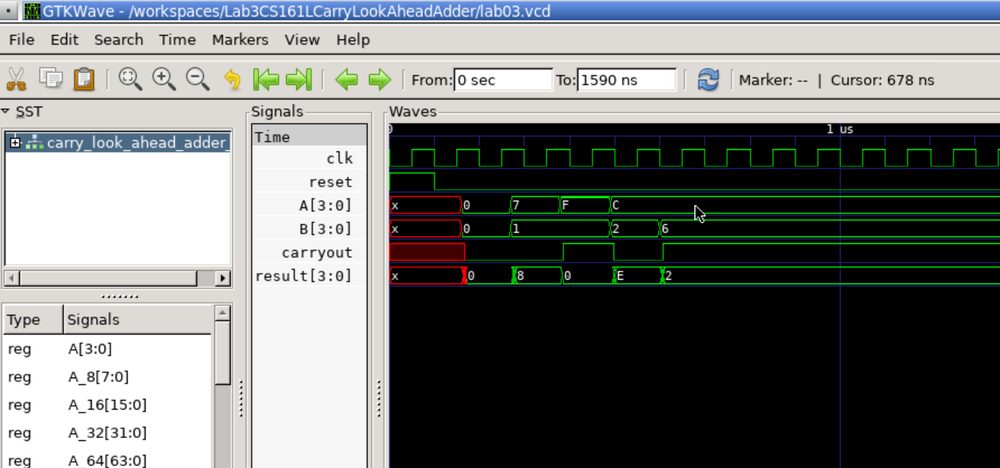

Name: Nicole Navarro
email: nnava026@ucr.edu

Testbench Descriptions: 
Tests in Section 1 are the provided tests, the remainder were the ones I created, copies and pasted over from Lab2 RippleCarryAdder as instructed. I made no changes to the testbench asside from adding a module for an 8bit adder because the default for this lab was actually 4 and the tests given were based on a 4bit system. I also fixed the description for the tests given with the lab because the numbers were written incorrectly.

1.1: 0 + 0 = 0, cout = 0. This is adding the 4bit values 0 and 0 which should give a result of 0 with 0 carryout.

1.2: 7 + 1 = 8, c_out = 0. This is adding the 4bit values 4'h7 and 4'h1 which should give a result of 8 with 0 carryout. 

1.3: 15 + 1 = 0 (16), c_out = 1. This is adding the 4bit values 4'hF and 4'h1 which should give a result of 0 because 16 cannot be represented with 4 bits and therefore there should be a carryout value of 1.

1.4: 12 + 2 = 14, c_out = 0. This is adding the 4bit values 4'd12 and 4'd2 which should give a result of 4'd14. Because it is under the number of values that can be represented with 4 bits, the carryout should be 0.

1.5: 12 + 6 = 2 (18), c_out = 1. This is adding the 4bit values 4'd12 and 4'd6 that should give a result of 2 because 18 cannot be represented with 4 bits and the remaining value after 16 is 2. Therefore the carryout value should be 1.

2.1: 0 + 0 = 0, c_out = 0. This is adding the 8bit values 0 and 0 which should give a result of 0 with 0 carryout.

2.2: 255 + 1 = 256, c_out = 1. This is adding the all 1's 8bit value 8'hff, 255, the max value that can be represented by 8 bits unsigned and the 8bit value 1 which would be 256, which would require 9 bits to show. In the 8 bit expected result there should be a 0, and the carryout bit should be 1 because of the overflow.

2.3: 11 + 11 = 22, c_out = 0. This is adding 2 8'h0B values to get 8'h16 in the result output with a carryout of 0, because 22 is less than 256.

2.4: 213 + 100 = 313, c_out = 1. This is adding the 8bit values 8'hD5 and 8'h64 which would give us a result of 313, which requires 9 bits because it is greater than 256. Therefore, the expected remaining 8 bits in the result should be 8'h39 which is a decimal 57, and there should be a carryout, so the carryout bit should be 1.

3.1: 65535 + 1 = 65536, c_out = 1. This is testing going 1 over the max value for a system of 16 bits adding 16 1's with another binary 1. This results with a 16bit 0 and a carryout of 1.

3.2: 4294967295 + 1 = 4294967296, c_out = 1. This is testing going 1 over the max value for a system of 32 bits adding 32 1's with another binary 1. This results with a 32bit 0 and a carryout of 1.

3.3 184467440737709551615 + 1 = 18446744073709551616, c_out = 1. This is testing going 1 over the max value for a system of 64 bits adding 64 1's with another binary 1. This results with a 64bit 0 and a carryout of 1.

3.4: 340282366920938463463374607431768211455 + 1 = 340282366920938463463374607431768211456, c_out = 1. This is testing going 1 over the max value for a system of 128 bits adding 128 1's with another binary 1. This results with a 128bit 0 and a carryout of 1.

Waveform:
Here is the waveform showing that there is no ripple and that the addition is complete after one propagation delay regardless of the size of the adder. You can see this when the reset goes to 0 and the clock starts its next cycle.
